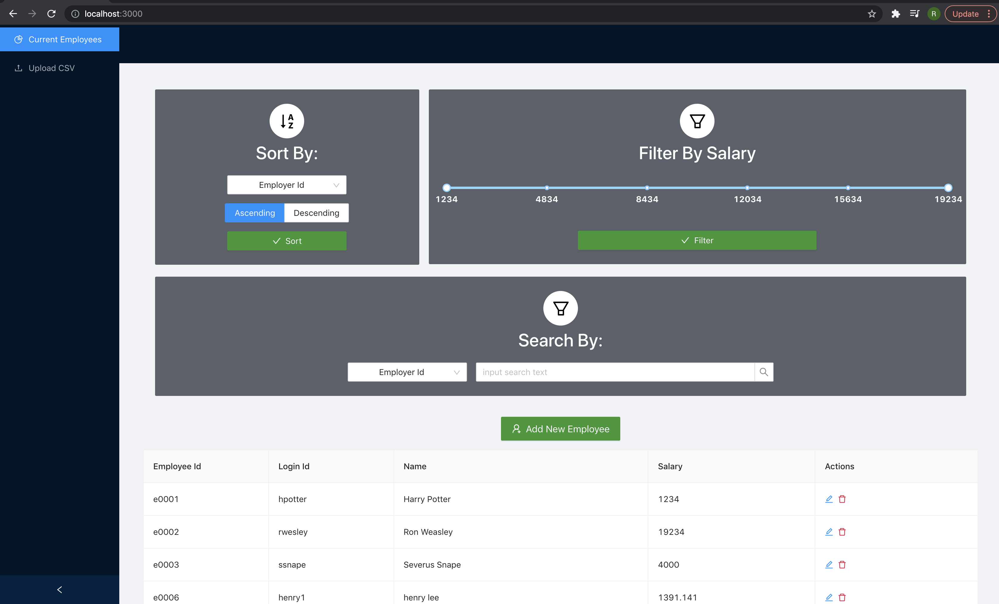

#Technology Associate Programme (TAP) 2021 Assessment: Employee Salary Management Web Application 

<!-- Overview-->
## Overview




This web application allows employees to store and obtain employee salary information by uploading CSV files or using the UI manually input data. The dashboard allows for easy filtering, sorting and searching for relevant employees. Modifications and deletions can also be done on existing employees.

As such, the user stories that have been completed are:
* User Story 1: Upload Users (Prioritized)
* User Story 2: Employee Dashboard Feature (Prioritized)
* User Story 3: CRUD Feature (Bonus)

<!-- Built With-->
### Built With

The technology stack:
* Frontend - [React](https://reactjs.org/)
* Frontend UI library - [Ant Design](https://ant.design/docs/spec/introduce)
* Backend - [Spring Boot](https://spring.io/projects/spring-boot)
* Non-persistent in-memory database - [H2 DataBase](https://www.h2database.com/html/main.html)

Other tools:
* Containerisation -  [Docker](https://www.docker.com/)
* Version Control - [Github](https://github.com/)

<!-- Setting Up-->
## Setting Up

  ```sh
  docker-compose up
  ```

The web application would then be running on the port of choice (which can be updated in docker-compose.yml), but the default is set as: http://localhost:3000/


<!-- Usage Details -->
## Usage Details
