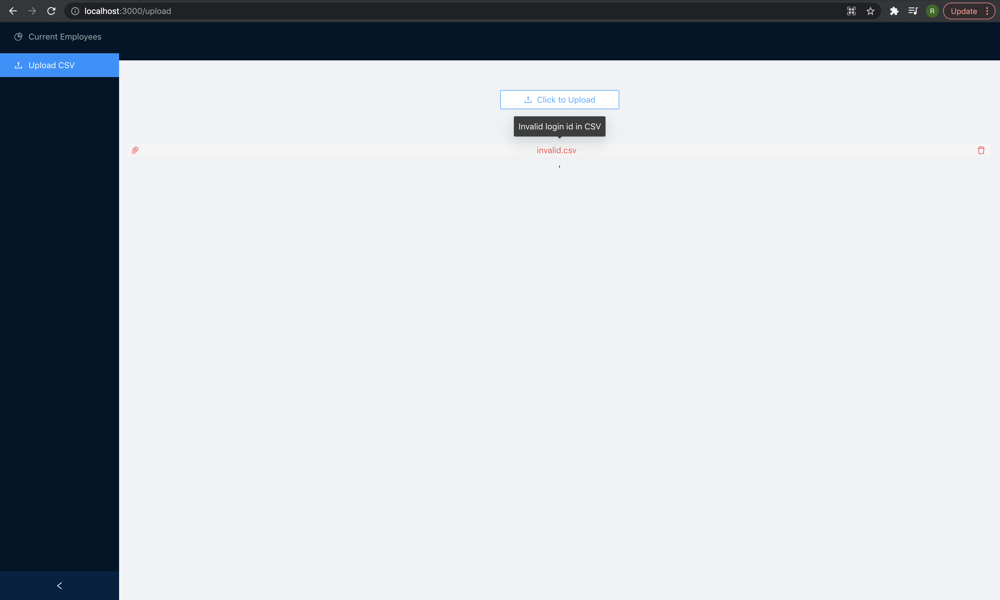

# Technology Associate Programme (TAP) 2021 Assessment: Employee Salary Management Web Application 

<!-- Overview-->
## Overview


<p>
    
    <em> Main page containing employee dashboard </em>
</p>

<p>
    
    <em> UploadPage to upload .csv files </em>
</p>


This web application allows employees to store and obtain employee salary information by uploading CSV files or using the UI manually input data. The dashboard allows for easy filtering, sorting and searching for relevant employees. Modifications and deletions can also be done on existing employees.

As such, the user stories that have been completed are:
* User Story 1: Upload Users (Prioritized)
* User Story 2: Employee Dashboard Feature (Prioritized)
* User Story 3: CRUD Feature (Bonus)

<!-- Built With-->
### Built With

The technology stack:
* Frontend - [React](https://reactjs.org/)
* Frontend UI library - [Ant Design](https://ant.design/docs/spec/introduce)
* Backend - [Spring Boot](https://spring.io/projects/spring-boot)
* Non-persistent in-memory database - [H2 DataBase](https://www.h2database.com/html/main.html)

Other tools:
* Containerisation -  [Docker](https://www.docker.com/)
* Version Control - [Github](https://github.com/)

<!-- Setting Up-->
## Setting Up

  ```sh
  docker-compose up
  ```

The web application would then be running on the port of choice (which can be updated in docker-compose.yml), but the default is set as: http://localhost:3000/


<!-- Usage Details -->
## Usage Details

###  1. Upload Users (Prioritized)
Navigation to the UploadPage is done by:
1. Update url: http://localhost:3000/upload
2. When on MainPage (i.e. root page, http://localhost:3000/), click button on side navigation bar: Upload CSV

Upon clicking "Click to Upload" on page, the user can choose a CSV file to upload. If the CSV file is uploading or the server is updating the database, the button for uploading CSV file is disabled.

If the CSV is invalid, namely:
1. Not .csv file format
2. Empty CSV file
3. Partial number of incorrect number of columns
4. Incorrect or missing header (i.e. id,login,name,salary)
5. Existence of incorrectly formatted rows or invalid salary
6. Existence of duplicate id or login (repetition of id or login already existing in database or in the csv file)

The upload will be indicated as a failure, and a pop-over will indicate the cause of the error.
An example where the login id is duplicated in the .csv is as follows:

<p>
    
    <em> Error indication on invalid csv file uploaded </em>
</p>

A successful upload of the csv file will result in the MainPage to be populated with the additional employee information. 

### 2. User Story 2: Employee Dashboard Feature (Prioritized)


Navigation to the MainPage is done by:
1. root url: http://localhost:3000/
2. When on UploadPage (i.e. http://localhost:3000/upload), click button on side navigation bar: Current Employees

#### A. Filter, Sort and Search
Users can filter and sort relevant employee information based on the field. Clicking "Sort", "Filter" or the search icon on the search bar will trigger get request to the backend server, rendering the filtered and sorted results on the page.

The get request endpoint is as follows: 
  ```sh
    @GetMapping("/users/sortOption={option}&sortOrder={order}&filterValue={lower}-{upper}&searchOption={soption}&searchValue={sval}")
  ```
<p>
    
    <em> Filter, sort and search on employee dashboard </em>
</p>


#### B. Add new employee
Besides that, clicking "Add New Employee" will open a modal, and the user can add individual employee's data.
This will send a PUT request on the "/users" endpoint to the backend server.

 <p>
     
     <em> Modal for users to input individual employee </em>
 </p>
 
 If the login or id already exists in the database, or the salary is invalid, a message will pop up indicating the failure.
  <p>
      
      <em> Error indication on invalid input </em>
  </p>

#### C. Delete or edit employee
Clicking the edit icon on the individual row will allow the user to change information of a particular employee. This will send a PATCH request on the "/users" endpoint to update information of the employee.
Updating to a login id that exists in the database will result in a failed update and an error message will be shown. The same would occur if it was updated to an invalid salary.
<p>
      
      <em> Error indication on invalid input </em>
  </p>
  
Clicking the delete icon on the individual row will delete the employee. This will send a DELETE request on the "/users" endpoint to the backend server.
<p>
      
      <em> Error indication on invalid input </em>
  </p>